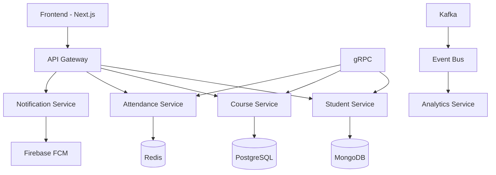
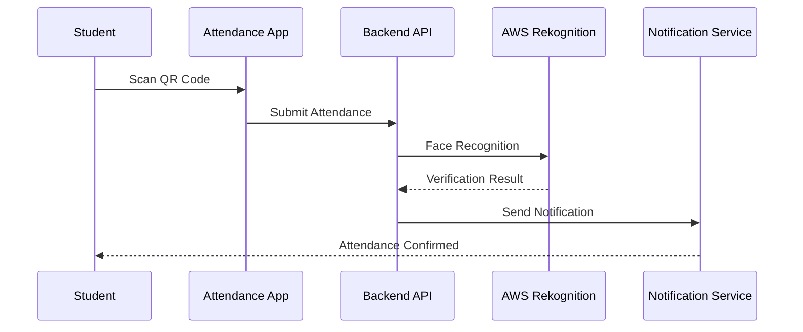

# Phạm Hồ Đăng Huy (Zohanubis)

## 🚀 Quick Navigation

---

## 📋 Table of Contents

| Section | Quick Links |
|---------|-------------|
| 🎓 **Education** | [Jump to Education](#-education) |
| 🚀 **Tech Stack** | [Jump to Tech Stack](#-tech-stack) |
| 🏆 **Projects** | [Jump to Projects](#-projects) |
| 🏅 **Achievements** | [Jump to Achievements](#-achievements) |
| 📊 **Stats** | [Jump to Stats](#-stats) |
| 📬 **Contact** | [Jump to Contact](#-contact) |

> **💡 Tip:** Press <kbd>Ctrl</kbd> + <kbd>F</kbd> to search quickly!

---

## 👨‍💻 About Me

> **Hi! I'm Pham Ho Dang Huy, a fourth-year Software Engineering student with a strong passion for back-end development, microservices, and cloud-native solutions. I love building scalable, maintainable systems and always strive for clean code and best practices. Currently, I'm seeking an internship to further hone my skills and gain real-world experience in software development.**

### 🌱 Specializations

- **Back-end Development** | **Microservices Architecture** | **Cloud & DevOps**

---

## 🎓 Education

| Institution | Program | Duration | Status |
|-------------|---------|----------|---------|
| **Ho Chi Minh City University of Industry and Trade** | Software Engineering | 2021 - Present | 🎓 **4th Year Student** |

---

## 🚀 Tech Stack

### 🌐 Web & Backend

  

### ☁️ DevOps & Cloud

  

### 🗄️ Databases

---

## 🏆 Projects

### 🎯 Featured Projects

<b>✨ HUIT-EDU (2024)</b> - Microservices Education Management System

#### 🏗️ Architecture Overview

#### 🛠️ Tech Stack (HUIT-EDU)

- **Frontend:** Next.js 15+, React 19, TypeScript, Tailwind CSS
- **Backend:** NestJS 11+, Microservices, gRPC, KafkaJS
- **Infrastructure:** Docker, Nx Monorepo, AWS

#### 🚀 Key Features (HUIT-EDU)

- ✅ Microservices architecture with gRPC communication
- ✅ Real-time notifications with Firebase FCM
- ✅ Event-driven architecture with Kafka
- ✅ Comprehensive student and course management

*Architecture diagram rendered with Mermaid[^3]*

  

  

<b>✨ Edu Attendance (2024)</b> - Smart Attendance System

#### 🏗️ System Flow

#### 🛠️ Tech Stack (Edu Attendance)

- **Backend:** NestJS 10+, RabbitMQ, MongoDB, Redis
- **Frontend:** Next.js 15+, Shadcn/UI, TypeScript
- **AI/ML:** AWS Rekognition for face recognition
- **Infrastructure:** Docker Compose, AWS S3

#### 🚀 Key Features (Edu Attendance)

- ✅ Face recognition attendance system
- ✅ Real-time notifications
- ✅ Role-based access control
- ✅ Comprehensive analytics dashboard

*Sequence diagram rendered with Mermaid[^3]*

  

---

## 🏅 Achievements

| Achievement | Year | Description | Certificate |
|-------------|------|-------------|-------------|
| 🥈 **2nd Prize** | 2025 | Academic Competition | [View Certificate](https://res.cloudinary.com/zohanubis/image/upload/fl_preserve_transparency/v1749702002/GiaiNhi-DigtalTransformChallenge._r2csef.jpg?_s=public-apps) |
| 🏆 **Finalist** | 2025 | Academic Competition | [View Certificate](https://res.cloudinary.com/zohanubis/image/upload/fl_preserve_transparency/v1749701985/ChungKet-DigtalTransformChallenge_mr5aw8.jpg?_s=public-apps) |
| 📚 **Participation** | 2025 | Student Scientific Research (Round 1) | [View Certificate](https://res.cloudinary.com/zohanubis/image/upload/fl_preserve_transparency/v1749701986/NCKH-Vong1_kjvskm.jpg?_s=public-apps) |

---

## 📊 GitHub Statistics

[^2]
[^2]
[^2]

### 🏆 GitHub Trophies

---

*Timeline chart rendered with Mermaid[^3]*

---

## 📬 Contact & Connect

### 📧 Get in Touch

### 📍 Location

**Ho Chi Minh City, Vietnam**

### 🎯 Looking For

- 🎓 **Internship opportunities** in Software Engineering
- 🤝 **Collaboration** on open-source projects
- 💼 **Full-time positions** starting 2025

---

## 💡 Quick Actions

---

### 📬 Ready to collaborate? Let's build something amazing together

*Proudly created with ❤️ by [Zohanubis](https://github.com/zohanubis)*

---

