<div align="center">

<br />

<h2>BACKEND &amp; FRONTEND ENGINEER</h2>

<sub><b>FULL-TIME SOFTWARE ENGINEER</b> · <b>SELECTIVE FREELANCE BUILDER</b> · <b>PRODUCT-MINDED FULLSTACK DEVELOPER</b></sub>

<br />
<br />


<br />
<br />

<a href="mailto:zohanubis.work@gmail.com"></a>
&nbsp;&nbsp;&nbsp;
<a href="https://linkedin.com/in/zohanubis"></a>
&nbsp;&nbsp;&nbsp;
<a href="https://github.com/zohanubis"></a>

<br />
<br />


<tr>
<td align="center">
<sub><b>ENGINEERING PRINCIPLE</b></sub><br />
<strong><em>I don’t stop when a challenge becomes solvable — I keep pushing until I overcome it, outgrow it, and come out stronger than before.</em></strong>
</td>
</tr>


</div>

---

<div align="center">

##  ENGINEERING PROFILE

<sub>FROM PRODUCT INTERFACE TO PRODUCTION INFRASTRUCTURE</sub>

</div>

> **FULL PRODUCT LAYER** · Frontend interfaces → Backend services → API contracts → Database flows → Deployment pipelines

I build across the full product layer: **frontend interfaces**, **backend services**, **API contracts**, **database flows**, and **deployment pipelines**. My strongest lane is **Fullstack Engineering** — using **React / Next.js / TypeScript** for product-facing experiences and **Java Spring Boot / Go** for backend systems.

I care about systems that are simple enough to ship, structured enough to maintain, and ready to scale when the business proves it needs to scale.

<div align="center">


</div>

---

<div align="center">

##  CURRENT MODE

<sub>ACTIVE ROLE · CURRENT FOCUS · PERSONAL ENGINEERING BRAND</sub>

<br />


</div>

```diff
+ ROLE        Fullstack Engineer
+ MAIN        Full-time software work
+ FREELANCE   Selective client systems
+ FOCUS       E-commerce · APIs · UI · Architecture
+ STYLE       Modern-classic · simple · structured
+ BRAND       Zohanubis
```

---

<div align="center">

##  ENGINEERING WORKFLOW

<sub>DISCOVER → DESIGN → BUILD → VERIFY → DELIVER → IMPROVE</sub>

</div>



```mermaid
flowchart LR
    A["01 · DISCOVER<br/>Problem · Users · Constraints"] --> B["02 · DESIGN<br/>Architecture · Contracts · Data"]
    B --> C["03 · BUILD<br/>Frontend · Backend · Integration"]
    C --> D["04 · VERIFY<br/>Tests · QA · Performance"]
    D --> E["05 · DELIVER<br/>CI/CD · Release · Documentation"]
    E --> F["06 · IMPROVE<br/>Observe · Learn · Iterate"]
    F -. feedback .-> A

    classDef discovery fill:#072A40,stroke:#0066B1,color:#FFFFFF,stroke-width:2px;
    classDef design fill:#0A3159,stroke:#1C69D4,color:#FFFFFF,stroke-width:2px;
    classDef build fill:#111111,stroke:#FFFFFF,color:#FFFFFF,stroke-width:2px;
    classDef verify fill:#3B1110,stroke:#E22718,color:#FFFFFF,stroke-width:2px;
    classDef deliver fill:#3D3200,stroke:#F4B400,color:#FFFFFF,stroke-width:2px;
    classDef improve fill:#102D25,stroke:#3ECF8E,color:#FFFFFF,stroke-width:2px;

    class A discovery;
    class B design;
    class C build;
    class D verify;
    class E deliver;
    class F improve;
```

> **OPERATING RULE** · Ship the smallest maintainable system, measure reality, then scale deliberately.

```mermaid
flowchart LR
    U["User / Business Need"] --> UI["Frontend Experience<br/>React · Next.js · TypeScript"]
    UI --> API["API Contract<br/>REST · GraphQL · gRPC"]
    API --> DOM["Domain & Service Logic<br/>Java Spring Boot · Go"]
    DOM --> DATA["Data Layer<br/>PostgreSQL · Supabase · Redis"]
    DATA --> OPS["Delivery & Operations<br/>Docker · Actions · Vercel"]
    OPS --> OBS["Observability<br/>Logs · Metrics · Feedback"]
    OBS -. improvement loop .-> U

    classDef blue fill:#072A40,stroke:#0066B1,color:#FFFFFF,stroke-width:2px;
    classDef lightblue fill:#0A3159,stroke:#1C69D4,color:#FFFFFF,stroke-width:2px;
    classDef neutral fill:#111111,stroke:#FFFFFF,color:#FFFFFF,stroke-width:2px;
    classDef red fill:#3B1110,stroke:#E22718,color:#FFFFFF,stroke-width:2px;
    classDef gold fill:#3D3200,stroke:#F4B400,color:#FFFFFF,stroke-width:2px;
    classDef green fill:#102D25,stroke:#3ECF8E,color:#FFFFFF,stroke-width:2px;

    class U blue;
    class UI lightblue;
    class API neutral;
    class DOM red;
    class DATA gold;
    class OPS,OBS green;
```

<details>
<summary><b>View the fullstack request-to-production map</b></summary>
<br />



</details>

---

<div align="center">

##  TOOLBOX

<sub>PRIMARY BUILD STACK · PLATFORM SERVICES · DELIVERY TOOLING</sub>

</div>

<div align="center">

### Core Stack


<br />
<br />

<table>
<tr>
<td align="center" width="110"><br /><sub><b>TypeScript</b></sub></td>
<td align="center" width="110"><br /><sub><b>React</b></sub></td>
<td align="center" width="110"><br /><sub><b>Next.js</b></sub></td>
<td align="center" width="110"><br /><sub><b>Java</b></sub></td>
<td align="center" width="110"><br /><sub><b>Spring Boot</b></sub></td>
<td align="center" width="110"><br /><sub><b>Go</b></sub></td>
</tr>
</table>

<table>
<tr>
<td align="center" width="110"><br /><sub>Clerk</sub></td>
<td align="center" width="110"><br /><sub>Supabase</sub></td>
<td align="center" width="110"><br /><sub>PostgreSQL</sub></td>
<td align="center" width="110"><br /><sub>Cloudinary</sub></td>
<td align="center" width="110"><br /><sub>Docker</sub></td>
<td align="center" width="110"><br /><sub>Actions</sub></td>
<td align="center" width="110"><br /><sub>Vercel</sub></td>
</tr>
</table>

</div>

---

<div align="center">
<table>
<tr>
<td valign="top" width="33%">

###  Frontend

- React.js
- Next.js
- TypeScript
- Tailwind CSS
- Shadcn/UI
- Figma-to-code
- Responsive UI
- SEO / GEO-oriented pages

</td>
<td valign="top" width="33%">

###  Backend

- Java Spring Boot
- Go / Chi
- REST APIs
- GraphQL
- tRPC / gRPC exposure
- JWT authentication
- DDD / Clean Architecture
- Hexagonal Architecture

</td>
<td valign="top" width="33%">

###  Delivery

- Docker
- GitHub Actions
- Vercel
- Supabase / PostgreSQL
- Redis-oriented queues
- Logging / monitoring
- Rate limiting
- Technical documentation

</td>
</tr>
</table>
</div>

---

<div align="center">

##  EXPERIENCE TIMELINE

<sub>PRODUCTION WORK · CLIENT DELIVERY · TEAM EXPERIENCE</sub>

</div>

<table>
<tr>
<td width="92" align="center" valign="top">

</td>
<td valign="top">

### Frontend Developer · Cyberskill Software Solutions

<sub><b>Jul 2025 — Present · Full-time · CNL Gaming</b></sub>

Building production e-commerce interfaces for **CNL Gaming**, a game-item commerce platform running across multiple domains. Working with **React, Next.js, TypeScript, Tailwind CSS, REST, GraphQL**, Figma handoff, QA workflows, and performance optimization.

<blockquote><b>DELIVERY HIGHLIGHTS</b> · 30+ reusable UI components · most major frontend pages · LCP improved from red to green · production issue handling · backend change notes when APIs/data contracts need updates.</blockquote>

</td>
</tr>
<tr>
<td align="center" valign="top">

</td>
<td valign="top">

### Backend Developer · Confidential Foreign Client

<sub><b>Aug 2025 — Present · Freelance / Shadow Engagement</b></sub>

Contributing to backend development using **Java** and **Spring Boot** under a confidential engagement. Focused on backend service logic, API implementation, documentation, and integration reliability while protecting client information.

<blockquote><b>DELIVERY HIGHLIGHTS</b> · backend modules · REST-oriented service layers · Java/Spring Boot delivery · confidential production-oriented work.</blockquote>

</td>
</tr>
<tr>
<td align="center" valign="top">

</td>
<td valign="top">

### Fullstack Web Intern · Cyberskill Software Solutions

<sub><b>Sep 2024 — Dec 2024 · Student Life Rental Platform</b></sub>

Contributed to a student rental platform connecting students and landlords, with a focus on transparent accommodation search. Worked in a cross-functional team across frontend, backend, BA, QA, DevOps, and PM.

<blockquote><b>DELIVERY HIGHLIGHTS</b> · home page · listing page · React/Next.js/TypeScript/Tailwind · MongoDB · REST/GraphQL exposure · Docker/GitHub Actions exposure.</blockquote>

</td>
</tr>
</table>

---

<div align="center">

##  FEATURED SYSTEMS

<sub>REAL PRODUCTS · REAL USERS · END-TO-END OWNERSHIP</sub>

</div>

<table>
<tr>
<td width="50%" valign="top">

###  Sang Mobile Ecommerce

<sub><b>Solo Fullstack Developer · Client Project · Jun 2026 — Present · Expected MVP Aug 2026</b></sub>

SEO & GEO-focused Vietnamese e-commerce platform for **mobile phones, used phones, accessories, SIM cards, and technology products**.

<sub><b>SYSTEM SCOPE</b></sub>
- Storefront + admin operation system
- Product catalog, category, brand, filter/search
- Cart, checkout, orders, customers, inventory
- PayOS QR payment, COD, cash payment
- Shipping, product condition, variants, comparison
- Role-based admin: owner, admin, staff, custom roles

<sub><b>STACK</b></sub>
Next.js · TypeScript · Go · Chi · REST API · Clerk · Supabase/PostgreSQL · ORM · Supabase Realtime · Cloudinary · Docker · GitHub Actions · Vercel

</td>
<td width="50%" valign="top">

###  LineApp VietNam

<sub><b>Fullstack Developer · Real-user Project · ~100 families</b></sub>

A family tree canvas web app that helps families visualize, create, update, and manage family relationships.

<sub><b>SYSTEM SCOPE</b></sub>
- Canvas-based family tree interface
- Owner-controlled access
- Viewer / editor permission model
- User, member, relationship, permission data modeling
- REST APIs for family tree workflows
- Vercel deployment + GitHub Actions CI/CD

<sub><b>STACK</b></sub>
Next.js · TypeScript · Clerk · Supabase · Prisma · REST API · Vercel · GitHub Actions

</td>
</tr>
<tr>
<td width="50%" valign="top">

###  Edu Attendance HUIT

<sub><b>Solo Fullstack Developer · Second Prize · HUIT Academic Competition 2024–2025</b></sub>

Award-winning student activity attendance and academic article submission system built solo for a university-level competition.

<sub><b>SYSTEM SCOPE</b></sub>
- Role-based student activity platform
- QR-code check-in
- AWS Rekognition facial verification
- Google Vision digital-signature verification
- Firebase Cloud Messaging notifications
- RPD, SRS, data models, system documentation

<sub><b>STACK</b></sub>
Next.js 15 · Shadcn/UI · Tailwind CSS · NestJS · MongoDB Replica Set · Redis · JWT · AWS S3 · Docker · GitHub Actions

</td>
<td width="50%" valign="top">

###  CNL Gaming

<sub><b>Production Frontend Work · Cyberskill Software Solutions</b></sub>

Production e-commerce platform for game items. This work is listed under professional experience to avoid duplicating the experience timeline, but it remains one of my strongest production product references.

<sub><b>PRODUCTION DOMAINS</b></sub>
- cnlgaming.com
- cnlgaming.io
- cnlgaming.ru
- cnlgaming.com.br/tr

<sub><b>FOCUS</b></sub>
Responsive UI · e-commerce flows · reusable components · API integration · QA collaboration · performance optimization

</td>
</tr>
</table>

---

<div align="center">
  
##  SIGNALS & PLACES

<table>
<tr>
<td align="center" width="33%">

<br />
<b>Cyberskill Software Solutions</b><br />
<sub>Frontend Developer · Full-time</sub>
</td>
<td align="center" width="33%">
<br />
<b>HUIT</b><br />
<sub>B.Sc. Software Engineering · 2022 — Nov 2025</sub>
</td>
<td align="center" width="33%">
<br />
<b>Selective Freelance</b><br />
<sub>Backend / Fullstack client systems</sub>
</td>
</tr>
</table>

</div>

---

<div align="center">

##  AWARD & EDUCATION

<sub>ACADEMIC FOUNDATION · COMPETITION-VALIDATED DELIVERY</sub>

</div>

<table>
<tr>
<td width="50%" valign="top">

### Second Prize — HUIT Academic Competition 2024–2025

<sub><b>“Digital Transformation Challenge” · University-level · 30 teams</b></sub>

Competed **solo** while most teams had multiple members. Awarded for **Edu Attendance HUIT**, a role-based system combining attendance, academic article workflows, QR verification, AI-assisted verification, and system documentation.

</td>
<td width="50%" valign="top">

### Ho Chi Minh City University of Industry and Trade

<sub><b>Bachelor of Science in Software Engineering · 2022 — Nov 2025</b></sub>

Relevant focus: data structures, database systems, web development, software architecture, object-oriented programming, and microservices design.

</td>
</tr>
</table>

---

<div align="center">

##  HOW I WORK

<sub>STRUCTURE · PRODUCT JUDGMENT · RESILIENCE · PURPOSEFUL SCALE</sub>

</div>

<table>
<tr>
<td width="25%" valign="top">

### 01 · Structure

I prefer clear boundaries, documented contracts, and code that can survive the next change.

</td>
<td width="25%" valign="top">

### 02 · Product

I care about the final user flow, not only the ticket. Good software should help the business move.

</td>
<td width="25%" valign="top">

### 03 · Difficulty

Hard problems are not a stop sign. They are where the next level of engineering judgment is built.

</td>
<td width="25%" valign="top">

### 04 · Scale

I don’t over-engineer early. I design simple systems first, then scale with purpose.

</td>
</tr>
</table>

---

<div align="center">

### BUILDING SYSTEMS THAT SURVIVE THE NEXT CHANGE

<sub>Product-minded engineering across interface, service, data, and delivery.</sub>

<br />
<br />

<a href="mailto:zohanubis.work@gmail.com"></a>
<a href="https://linkedin.com/in/zohanubis"></a>

<br />
<br />


</div>

