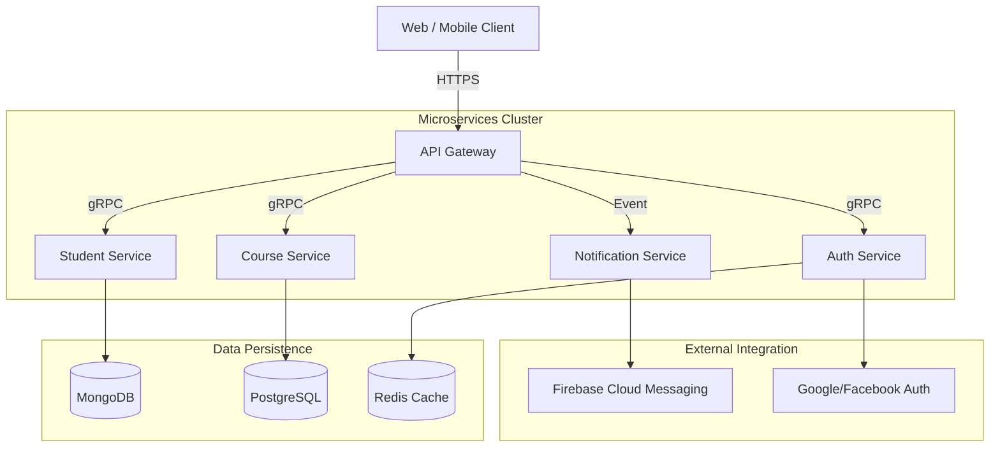
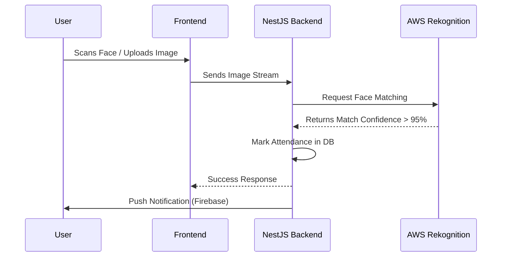

# Phạm Hồ Đăng Huy (Zohanubis)

;Building+Scalable+Systems;From+Concept+to+Production>)

  

## 👨‍💻 About Me

> **"I don't just write code; I engineer solutions."**

I am a **Fullstack Software Engineer** with over **1 year of professional experience** in designing, developing, and deploying high-performance web applications. My expertise spans the entire software development lifecycle—from crafting responsive Frontend interfaces to architecting robust Backend microservices and managing cloud infrastructure on **AWS**.

I have successfully delivered multiple outsourcing projects, transforming complex client requirements into production-ready systems. I specialize in building **Microservices**, implementing **DevOps** pipelines, and optimizing cloud resources for cost and performance.

### 🚀 Core Competencies

- **Fullstack Development:** Seamless integration of modern Frontends (Next.js, React) with powerful Backends (NestJS, Spring Boot).
- **Cloud & DevOps:** Extensive experience deploying and managing applications on **AWS** (EC2, S3, RDS, Lambda) using **Docker** and **Kubernetes**.
- **System Architecture:** Proven ability to design scalable, event-driven, and microservices-based architectures.

---

## 💼 Work Experience

| Role                            | Organization / Type         | Period         | Key Responsibilities                                                                                                                                                                                                                                                                                                                                                                                                                                                            |
| :------------------------------ | :-------------------------- | :------------- | :------------------------------------------------------------------------------------------------------------------------------------------------------------------------------------------------------------------------------------------------------------------------------------------------------------------------------------------------------------------------------------------------------------------------------------------------------------------------------ |
| **Fullstack Software Engineer** | **Freelance / Outsourcing** | 2024 - Present | • Delivered **end-to-end web solutions** for diverse clients, handling everything from UI/UX implementation to Backend logic and Database design. • Deployed and maintained production environments on **AWS**, ensuring 99.9% uptime. • Optimized application performance, reducing API latency by **40%** through caching (Redis) and database indexing. • Integrated 3rd-party services (Payment Gateways, OAuth, Google Maps) to enrich application functionality. |
| **Software Engineer**           | **Graduation Project**      | 2025           | • Graduated with an **Engineer's Degree** in Software Engineering. • Lead Developer for capstone projects focusing on Enterprise Resource Planning (ERP) and Smart Education systems.                                                                                                                                                                                                                                                                                        |

---

## 🛠️ Technical Arsenal

### 🌐 Frontend & UI

### ⚙️ Backend & API

### ☁️ Cloud & DevOps

### 🗄️ Databases & Caching

---

## 🏆 Featured Projects

<h3>✨ HUIT-EDU – EdTech Microservices Ecosystem (2024)</h3>

> _A comprehensive education management platform built with microservices architecture to handle high-concurrency requests._

**Role:** Solution Architect & Fullstack Developer

#### 🏗️ System Architecture

**Key Highlights:**

- **Scalability:** Designed independent services communicating via **gRPC** for low-latency internal networking.
- **Event-Driven:** Implemented **Apache Kafka** to handle asynchronous tasks like grade processing and mass notifications.
- **Deployment:** Containerized with **Docker** and orchestrated using **Kubernetes**, deployed on **AWS EKS**.

<h3>✨ Smart Attendance – AI Face Recognition System (2024)</h3>

> _An automated attendance system leveraging AI to streamline classroom management._

**Role:** Backend Lead & Infra Engineer

#### 🔄 User Flow

**Key Highlights:**

- **AI Integration:** Seamless integration with **AWS Rekognition** for <1s face verification.
- **Real-time:** Used **Socket.io** to update attendance dashboards instantly for teachers.
- **Security:** Implemented secure signed URLs for S3 bucket access to protect student data.

---

## 🏅 Honors & Awards

| Year     | Award                    | Description                                                                                    |
| :------- | :----------------------- | :--------------------------------------------------------------------------------------------- |
| **2025** | 🥈 **2nd Prize**         | **Digital Transform Challenge** - Recognized for innovative use of Microservices in Education. |
| **2025** | 🏆 **National Finalist** | **S.M.A.C Challenge** - Top 10 teams nationwide.                                               |
| **2024** | 🥇 **Excellent Degree**  | Graduated with honors in Software Engineering.                                                 |

---

## 📊 Analytics

  
  

  

---

  
  ### 📬 Let's Collaborate!
  
  *I am currently open to new opportunities. If you need a scalable solution or a reliable engineer, hit me up!*
  
  
  
  
  
   

  
  
  
© 2025 Designed by Zohanubis

